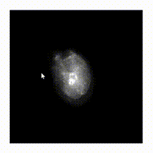

# fMRI-Volumetric-Renderer
A volumetric fMRI renderer for the web. Built using WebGL.

This project presents a method for visualizing volumetric MRI and fMRI data based on a discrete raytracing algorithm and OpenGL.
Data is pre-processed and then attached to the html template document, the renderer itself is written in html. This method presents a lightweight 
renderer that can be used to visualize fMRI data in a browser as well as in the output of a jupyter notebook. Includes support for rgba color mapping.

Live version:
https://kappnkrunch.github.io/fMRI-Volumetric-Renderer/example1.html

